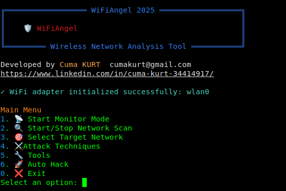
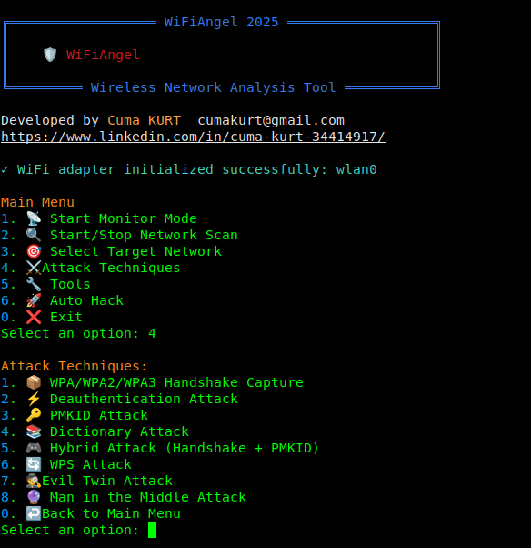
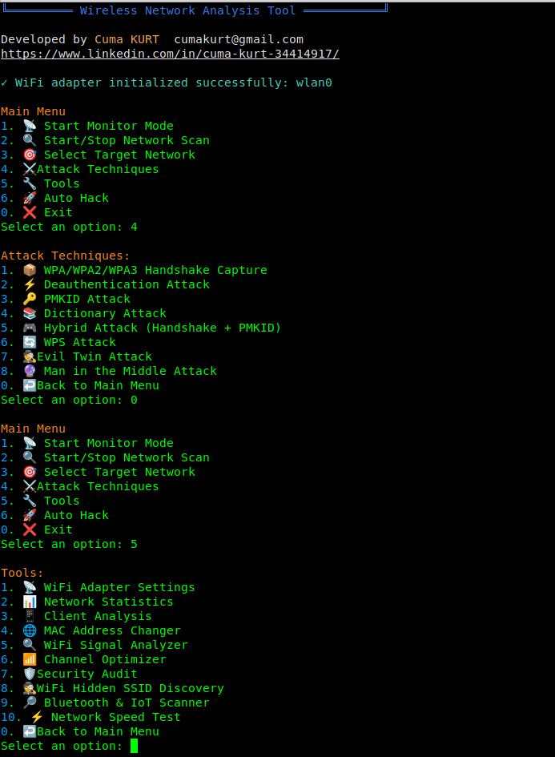

# WiFiAngel - Wireless Network Security Analysis Tool

<p align="center">
  
</p>

<div align="center">

[](https://www.python.org/downloads/)
[](https://www.gnu.org/licenses/gpl-3.0.html)
[](https://www.linux.org/)
[](https://www.kali.org/)

</div>

[🇹🇷 Türkçe Dokümantasyon için tıklayın](#türkçe-dokümantasyon)

## 🌟 Features

- 📡 **Network Discovery & Monitoring**
  - Real-time network scanning
  - Hidden SSID discovery
  - Client detection and tracking
  - Signal strength analysis

- 🔒 **Security Analysis**
  - WPA/WPA2/WPA3 handshake capture
  - PMKID attack support
  - Dictionary attack capabilities
  - Evil Twin attack framework
  - Man-in-the-Middle (MITM) attack 

- 🛠️ **Advanced Tools**
  - Channel optimization
  - MAC address spoofing
  - Network speed testing
  - Bluetooth & IoT device scanning
  - Traffic analysis

- 📊 **Reporting & Analysis**
  - Detailed attack logs
  - Network statistics
  - Client analysis
  - Security audit reports
  - HTML and text report generation

## 📸 Screenshots

<p align="center">
  
  
  
</p>

## 🚀 Installation

1. Clone the repository:
```bash
git clone https://github.com/cumakurt/wifiangel.git
cd wifiangel
```

2. Install required packages:
```bash
sudo apt update
sudo apt install -y aircrack-ng hashcat hcxdumptool hostapd dnsmasq macchanger reaver python3-scapy
```

3. Install Python dependencies:
```bash
pip3 install -r requirements.txt
```

## 💻 Usage

Run the tool with root privileges:

```bash
sudo python3 wifiangel.py
```

## 🛡️ Features in Detail

### Network Discovery
- Active and passive network scanning
- Real-time signal strength monitoring
- Client detection and tracking
- Hidden network discovery

### Attack Techniques
- WPA/WPA2/WPA3 handshake capture
- PMKID attack
- Evil Twin attack
- Deauthentication attack
- Dictionary attack
- Hybrid attack (Handshake + PMKID)

### Analysis Tools
- Channel optimization
- Signal strength analysis
- Client behavior analysis
- Network speed testing
- Security audit

### Reporting
- Detailed HTML reports
- Attack logs
- Network statistics
- Security recommendations

## ⚠️ Legal Disclaimer

This tool is provided for educational and testing purposes ONLY. Users are responsible for complying with all applicable local, state, and federal laws. Developers assume NO liability and are NOT responsible for any misuse or damage caused by this program.

## 📝 License

This project is licensed under the GPL-3.0 License - see the [LICENSE](LICENSE) file for details.

---

# Türkçe Dokümantasyon

## 🌟 Özellikler

- 📡 **Ağ Keşfi ve İzleme**
  - Gerçek zamanlı ağ taraması
  - Gizli SSID keşfi
  - İstemci tespiti ve takibi
  - Sinyal gücü analizi

- 🔒 **Güvenlik Analizi**
  - WPA/WPA2/WPA3 el sıkışması yakalama
  - PMKID saldırı desteği
  - Sözlük saldırısı yetenekleri
  - Evil Twin saldırı çerçevesi
  - Ortadaki Adam (MITM) saldırısı

- 🛠️ **Gelişmiş Araçlar**
  - Kanal optimizasyonu
  - MAC adresi değiştirme
  - Ağ hız testi
  - Bluetooth ve IoT cihaz taraması
  - Trafik analizi

- 📊 **Raporlama ve Analiz**
  - Detaylı saldırı günlükleri
  - Ağ istatistikleri
  - İstemci analizi
  - Güvenlik denetim raporları
  - HTML ve metin rapor oluşturma

## 🚀 Kurulum

1. Depoyu klonlayın:
```bash
git clone https://github.com/cumakurt/wifiangel.git
cd wifiangel
```

2. Gerekli paketleri yükleyin:
```bash
sudo apt update
sudo apt install -y aircrack-ng hashcat hcxdumptool hostapd dnsmasq macchanger reaver python3-scapy
```

3. Python bağımlılıklarını yükleyin:
```bash
pip3 install -r requirements.txt
```

## 💻 Kullanım

Aracı root yetkileriyle çalıştırın:

```bash
sudo python3 wifiangel.py
```

## 🛡️ Detaylı Özellikler

### Ağ Keşfi
- Aktif ve pasif ağ taraması
- Gerçek zamanlı sinyal gücü izleme
- İstemci tespiti ve takibi
- Gizli ağ keşfi

### Saldırı Teknikleri
- WPA/WPA2/WPA3 el sıkışması yakalama
- PMKID saldırısı
- Evil Twin saldırısı
- Deauthentication saldırısı
- Sözlük saldırısı
- Hibrit saldırı (El sıkışması + PMKID)

### Analiz Araçları
- Kanal optimizasyonu
- Sinyal gücü analizi
- İstemci davranış analizi
- Ağ hız testi
- Güvenlik denetimi

### Raporlama
- Detaylı HTML raporları
- Saldırı günlükleri
- Ağ istatistikleri
- Güvenlik önerileri

## ⚠️ Yasal Uyarı

Bu araç YALNIZCA eğitim ve test amaçları için sağlanmıştır. Kullanıcılar tüm geçerli yerel ve genel  yasalara uymakla yükümlüdür. Geliştiriciler, bu programın herhangi bir yanlış kullanımından veya neden olduğu hasardan sorumlu DEĞİLDİR ve hiçbir şekilde sorumluluk kabul etmez.

## 📝 Lisans

Bu proje GPL-3.0 Lisansı altında lisanslanmıştır - detaylar için [LICENSE](LICENSE) dosyasına bakın. 
