# WiFiAngel


WiFiAngel is an interactive **terminal (TUI)** application for **authorized** wireless security work on Linux. It uses [Rich](https://github.com/Textualize/rich) for menus and live tables, and orchestrates common Wi‑Fi and lab tools: **aircrack-ng**, **hcxdumptool** / **hcxtools**, **hashcat**, **hostapd**, **dnsmasq**, **bettercap**, **reaver**, and others.

**Use only on networks and equipment you own or have explicit written permission to test.** Unauthorized interception of networks or traffic is illegal in most jurisdictions.

---

## Contents

- [Features](#features)
- [Requirements](#requirements)
- [Installation](#installation)
- [Quick start](#quick-start)
- [Using the application](#using-the-application)
- [Screenshots](#screenshots)
- [Runtime files and reports](#runtime-files-and-reports)
- [Repository layout](#repository-layout)
- [Development](#development)
- [License and disclaimer](#license-and-disclaimer)

---

## Features

### Core workflow

| Area | What it does |
|------|----------------|
| **Monitor mode** | Puts the chosen adapter into monitor mode via `airmon-ng` / `iw`, with interface resolution (e.g. `wlan0` → `wlan0mon`) through `WiFiAdapterManager`. Main menu option **7** switches back to managed mode. |
| **Network discovery** | Passive scan using **`airodump-ng`** CSV export (`--band abg`). The scan loop skips a full re-parse when the CSV file has not changed. Results merge into an in-memory AP list: SSID, BSSID, channel, security, signal, clients, and WPS hints. |
| **Live scan UI** | While scanning from the main menu, a live Rich **table** updates; option **2** starts or stops the same scan. |
| **Target selection** | Choose a BSSID from discovered networks. The TUI shows an **assessment playbook**: AKM (PSK/SAE/802.1X/Open), capture mode (active vs passive), and the next existing module. PMF/SAE-only targets skip deauth. |

### Attack techniques menu

All attack flows assume a **selected target** where applicable. The app asks for legal-use confirmation once at startup instead of repeating per-module confirmations.

| # | Feature | Summary |
|---|---------|---------|
| **1** | **WPA / WPA2 / WPA3 handshake capture** | Advanced capture engine: `airodump-ng` plus optional `hcxdumptool` PMKID source, PMF/WPA3-aware deauthentication strategy, client prioritization, frame-level EAPOL replay scoring (cached while the pcap is unchanged), live quality telemetry, best-artifact promotion, manifest JSON, optional `.22000` export, and hashcat job queue integration. |
| **2** | **Deauthentication** | Submenu: broadcast deauth to all associated clients, or targeted deauth to one client MAC (`aireplay-ng`). |
| **3** | **PMKID capture** | `hcxdumptool` capture to `pcapng`, conversion with **`hcxpcapngtool`** to **22000** hash format, optional PMKID verification helpers. |
| **4** | **Dictionary attack** | Run **`aircrack-ng`** (or related flow) against a captured handshake using a wordlist (defaults under `config/defaults.py`). Recovered passphrases are shown in the TUI; they are **not** written to `main.log`. |
| **5** | **Hybrid (handshake + PMKID)** | Combined capture path: handshake and PMKID in one workflow, then crack attempts as data becomes available. |
| **6** | **WPS attack** | **`reaver`**: Pixie Dust (`-K 1`) or PIN brute force, with live output in the TUI (requires WPS-enabled target). |
| **7** | **Evil Twin lab** | **`hostapd`** + **`dnsmasq`** fake AP. Optional **lab captive portal** (HTTP + DNS sink) and **client isolation** with a two-lease AP reachability check. NAT uses scoped `WIFIANGEL_ET_*` chains (no host-wide `iptables -F`). Session `hostapd`/`dnsmasq` processes are stopped by PID on teardown. SSID defaults to the selected target, otherwise the most-probed client PNL name from the last scan. |
| **8** | **Man-in-the-Middle toolkit** | Requires **`bettercap`**: interface + gateway selection, **parallel ping sweep** for live hosts (Ctrl+C cancels), ARP spoof + sniff caplet, Rich **Live** dashboard. NAT uses a scoped `WIFIANGEL_MITM_NAT` chain and never flushes the host firewall. Session logs under `logs/mitm/<timestamp>/`. |
| **9** | **Hashcat job manager** | Queue dictionary, **rules** (`-r`), or **mask** (`-a 3`) jobs against `.22000` hashes; list status and show `--restore` argv. Jobs are stored with a file lock and atomic replace. Same store as Tools → Technical intelligence. |
| **10** | **EAP lab AP** | Local **WPA-EAP** access point via **`hostapd` `eap_server`** (PEAP/TTLS, operator-chosen lab identity). Self-signed cert; **not** an external RADIUS relay. Same dual-radio / DHCP / optional portal path as the PSK Evil Twin lab. |

### Tools menu

| # | Feature | Summary |
|---|---------|---------|
| **1** | **Wi-Fi adapter settings** | Toggle **monitor / managed** mode, **set channel**, show adapter info, **select capture NIC** and optional second **AP NIC** for Evil Twin without restarting the TUI. |
| **2** | **Network statistics** | Table of discovered networks: channels, security, signal, clients, data packet counts, first/last seen (requires prior scan data). |
| **3** | **Client analysis** | Lists client MACs observed per network with security context. |
| **4** | **MAC address changer** | Wrapper around **`macchanger`**: show, random, custom, restore. |
| **5** | **Signal analyzer** | Signal-strength oriented view for scanned APs. |
| **6** | **Channel optimizer** | Channel recommendation / analysis helpers for 2.4/5 GHz scans. |
| **7** | **Security audit** | High-level security posture summary from scan-derived data. |
| **8** | **Hidden SSID discovery** | Workflows to infer or surface hidden SSIDs where frames allow. |
| **9** | **Bluetooth and IoT scan** | **`bleak`**-based BLE discovery; lists nearby BLE devices when available. |
| **10** | **Network speed test** | Upload/download probes via **`curl`** (or configured runners), with formatted throughput and simple recommendations. |
| **11** | **RF Environment Profiler** | Channel density, estimated noise pressure, and overlap-aware interference profiling; suggests best channels for targeting strategy. |
| **12** | **Handshake Validator Pro** | Multi-source validation for captured handshake/PMKID artifacts using quality scoring plus `aircrack-ng` and `hcxhashtool` checks when available. |
| **13** | **Wordlist Intelligence** | Generates SSID/OUI/vendor-aware candidate wordlists with scored mutations and optional export. |
| **14** | **Capture Health Checker** | Validates `.cap` / `.pcapng` / `.22000` capture integrity, duplicate records, and corrupt entries with a health verdict. |
| **15** | **WPS Risk Analyzer** | Estimates WPS lock-state exposure, rate-limit hints, and practical success window for WPS-enabled targets. |
| **16** | **Channel Hopper Optimizer** | Adaptive per-channel dwell and hop-interval optimization based on live network/client pressure. |
| **17** | **Technical intelligence** | Submenu: capture quality, 802.11 frame intel, artifact index, hashcat jobs, PMF/WPA3 table, client/interface profilers, telemetry, and the Tools 11–16 analyzers. |
| **18** | **Network hopper** | Dwell on each discovered AP channel in turn. |
| **19** | **Generate HTML session report** | Write the current session log tree to HTML, including the assessment playbook and any sessions attached from Tools 21. |
| **20** | **Probe SSIDs (client PNL)** | Rank SSIDs from airodump-ng **Probed ESSIDs**, including unassociated stations. The top usable name is the Evil Twin default when no broadcast target SSID is selected. |
| **21** | **Session browser** | Browse `handshake/`, `auto_hack_sessions/`, `logs/mitm/`, and hashcat jobs. Re-validate artifacts, queue a dictionary hashcat job, or attach rows to the Tools 19 HTML report. |

### Automated assessment workflow

Automated **lab-style** pipeline. Legal-use confirmation is requested once at startup; runtime modules do not repeat legal disclaimers or authorization prompts.

1. **Monitor mode** via the same adapter path as the main menu (`WiFiAdapterManager`).
2. **Discovery** — **60 seconds** of **`airodump-ng`** with the same live network table used by the main menu scan.
3. **Prioritization** — scores networks (clients, signal, cipher family, WPS, etc.) and shows a **prioritized table**.
4. **Target selection** — comma-separated indices or explicit `all`; empty or invalid input cancels instead of broadening scope.
5. **Sequential assessments** — one radio (`max_workers=1`); only networks **with observed clients**. Each worker runs **airodump** + **hcxdumptool**, **deauth** bursts (unless the playbook skips them), a **3–5 minute** capture window, then **`aircrack-ng`** / **`hashcat`** with process timeouts. **Live** status panel shows **per-target heartbeat**.
6. **Results table** and summary statistics; artifacts under **`auto_hack_sessions/<timestamp>/`**. Recovered Wi-Fi passphrases are shown in the TUI and HTML report; file logs redact them. Store outputs securely.

### Logging, NAT, and reports

- **`Logger`** writes timestamped logs under **`logs/<timestamp>/`** (main, attacks, networks, clients, evil twin, DNS, traffic helpers). Child loggers do not duplicate lines into `main.log`.
- Recovered passphrases are **TUI / HTML only** — not appended to `main.log`.
- **`generate_report()`** produces security-oriented **HTML** via the `reports` package.
- MITM runs create **`logs/mitm/<timestamp>/`** (caplets, stdout/stderr, traffic/sensitive logs).
- Lab NAT is **scoped**: `WIFIANGEL_ET_*` for Evil Twin, `WIFIANGEL_MITM_NAT` for MITM. Exit and module teardown remove those chains without flushing the host firewall.

---

## Requirements

- **OS:** Linux with a real wireless adapter (not WSL without USB passthrough; VMs need the device passed through).
- **Privileges:** **root** (`sudo`).
- **Python:** 3.8+ recommended (3.10+ well tested).

### Python dependencies

```bash
pip install -r requirements.txt
```

Installed packages: `rich`, `scapy`, `netifaces`, `bleak`, `zeroconf`.

### System tools

**Checked at session start** (must be on `PATH`): `airmon-ng`, `airodump-ng`, `aireplay-ng`, `hashcat`, `hcxdumptool`.

**Commonly required for full feature set:**

| Area | Typical packages (Debian/Ubuntu) |
|------|----------------------------------|
| Core Wi‑Fi / crack | `aircrack-ng`, `hashcat`, `hcxdumptool`, `hcxtools` (`hcxpcapngtool`) |
| Evil Twin / EAP lab AP | `hostapd`, `dnsmasq`, `openssl`; `iptables`, `iproute2` |
| WPS | `reaver` |
| MITM | `bettercap` |
| Optional helpers | `curl`, `nmcli`, `macchanger`, `net-tools` (`ifconfig`), `wpaclean` |

Example:

```bash
sudo apt update
sudo apt install -y aircrack-ng hashcat hcxdumptool hcxtools hostapd dnsmasq openssl macchanger reaver curl iproute2 iptables
# Optional
sudo apt install -y bettercap network-manager
```

On startup, **`app.main`** also runs **`warn_optional_missing_tools`** so you see which optional binaries are missing before using specific menus.

---

## Installation

```bash
git clone <repository-url>
cd wifiangel
chmod +x run.sh
./run.sh
```

`run.sh` installs required system packages (when the distro/package manager is known), creates `.venv` from `requirements.txt`, and starts the TUI. WiFiAngel still needs **root** at runtime, so the script re-execs with `sudo` if you launched it as a normal user.

Manual install remains:

```bash
pip install -r requirements.txt
```

---

## Quick start

From the repository root:

```bash
./run.sh
```

Equivalent:

```bash
sudo python3 wifiangel.py
```

The launcher:

1. Verifies **root**, **OS**, and **Python imports**
2. Creates **runtime directories** (`logs`, `tmp`, `handshake`, `auto_hack_sessions`)
3. Warns about **optional** missing tools
4. Shows the **welcome banner** and **main menu**

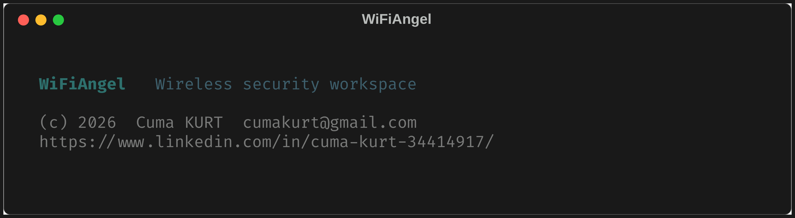

---

## Using the application

### Main menu

| Key | Action |
|-----|--------|
| **1** | Start **monitor mode** on the configured adapter |
| **2** | **Start or stop** network scan (**airodump-ng** CSV loop + live table) |
| **3** | **Select target network** from the current scan results |
| **4** | Open **Attack techniques** submenu |
| **5** | Open **Tools** submenu |
| **6** | Run **Automated assessment workflow** |
| **7** | Switch the capture adapter back to **managed mode** |
| **0** | **Exit** (stops an active scan, drops lab NAT chains, restores managed mode) |

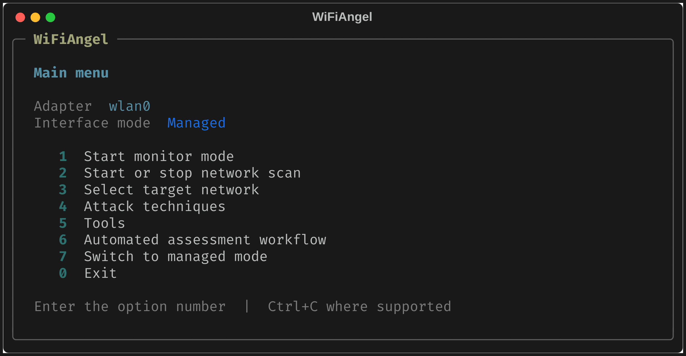

**Ctrl+C** from the main menu stops an active scan or exits / returns depending on context. Unexpected crashes exit with code **1** after the same cleanup path.

While a scan is running, the same menu shows a `LIVE` banner and the **Networks in range** table. Option **2** stops the scan.

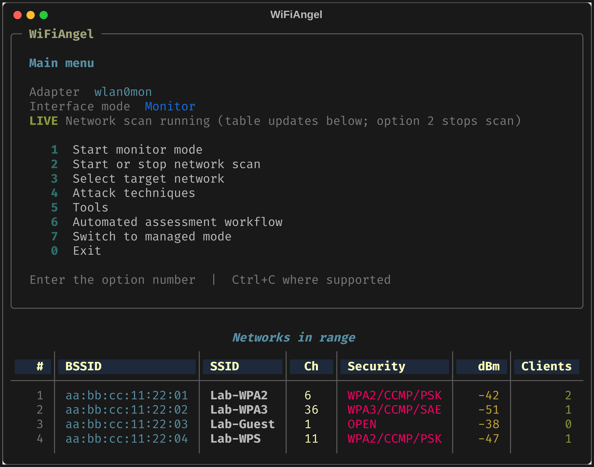

### Select target

Option **3** lists discovered APs with the playbook **Next** column, then the **Assessment playbook** for the chosen BSSID.

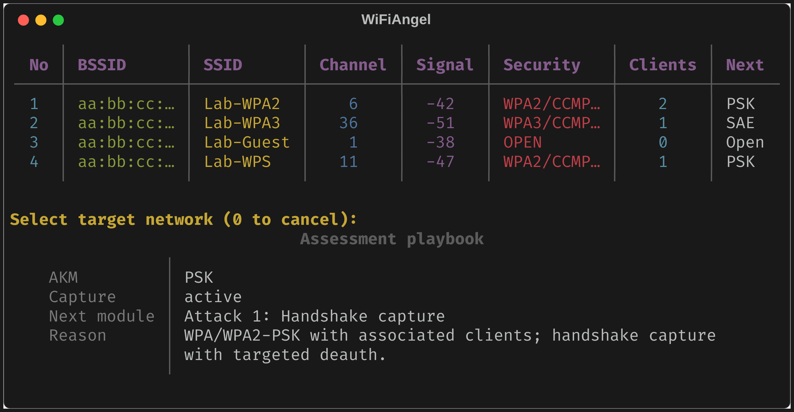

### Attack techniques

Option **4** opens the attack list. The target banner shows AKM, capture mode, and the recommended next module.

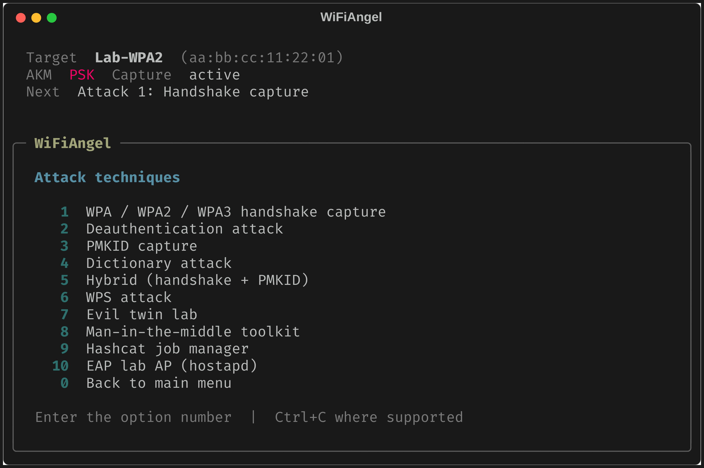

Deauthentication is a submenu: broadcast to all associated clients, or a single client MAC.

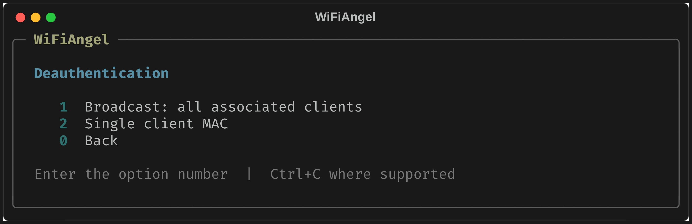

Handshake capture shows live EAPOL scoring, deauth strategy, session manifest, and a summary with optional hashcat job id.

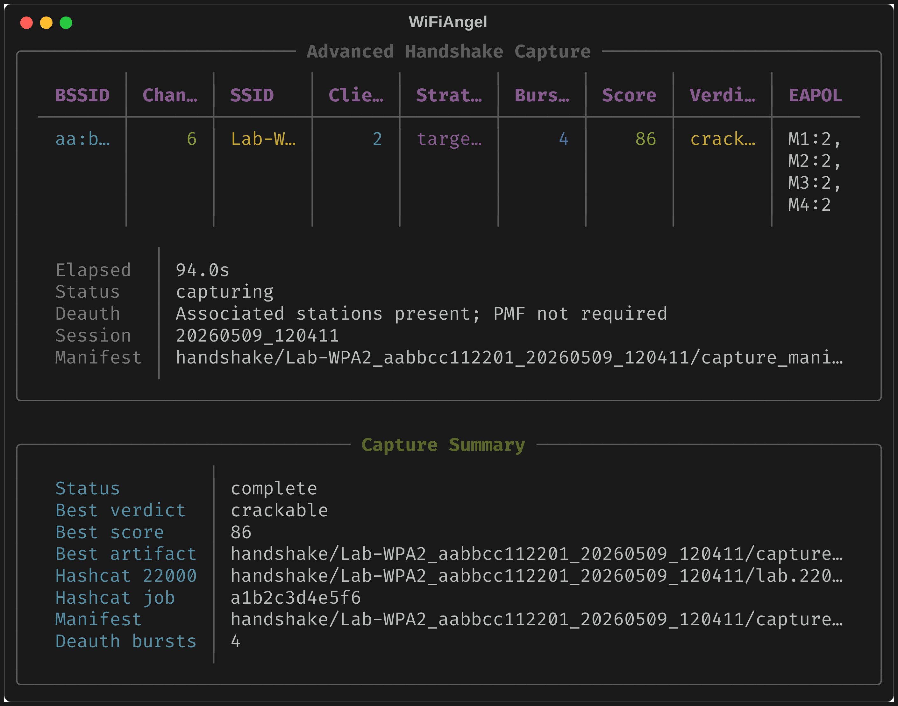

Hashcat jobs (dictionary/rules, mask `-a 3`, restore argv) live under Attacks **9** and Tools **17**.

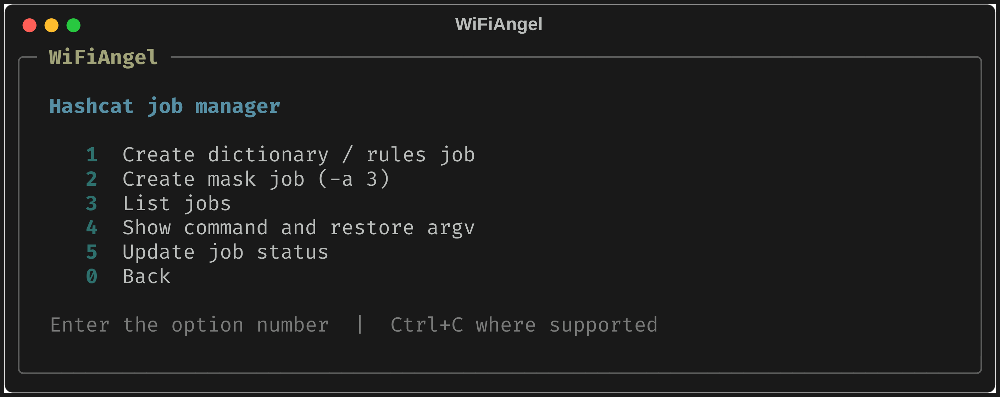

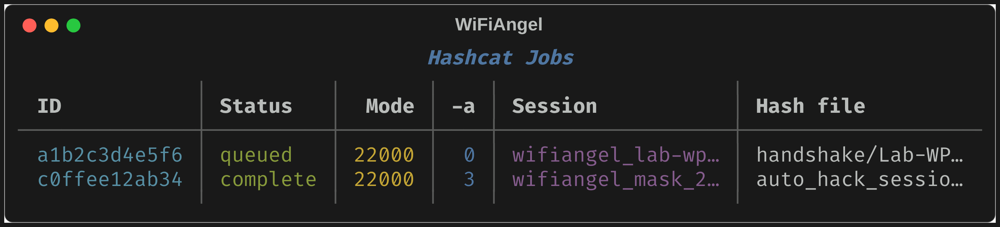

Evil Twin lab AP status, DHCP clients, and scoped `WIFIANGEL_ET_*` NAT:

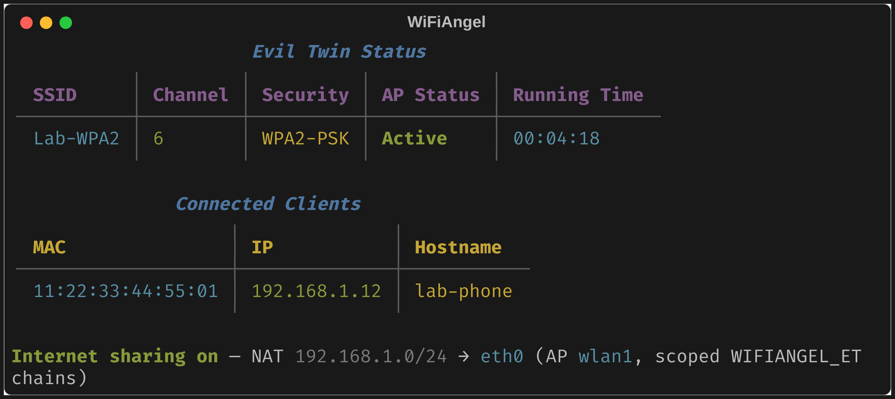

MITM dashboard (Bettercap traffic digest, ARP clients, scoped `WIFIANGEL_MITM_NAT`). Ctrl+C stops the session.

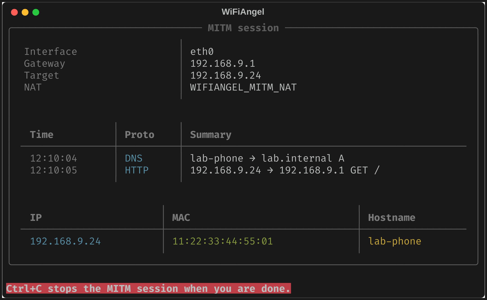

### Tools

Option **5** opens diagnostics, RF helpers, HTML report, probe SSIDs, and the session browser.

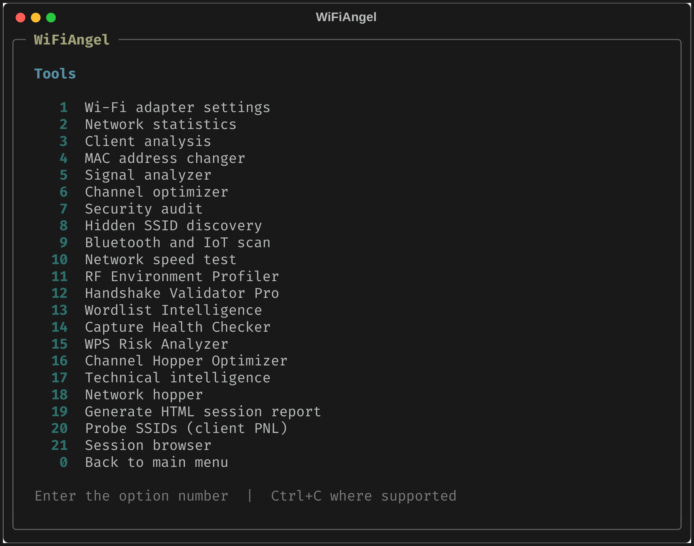

Capture NIC vs optional second **Evil Twin AP** NIC:

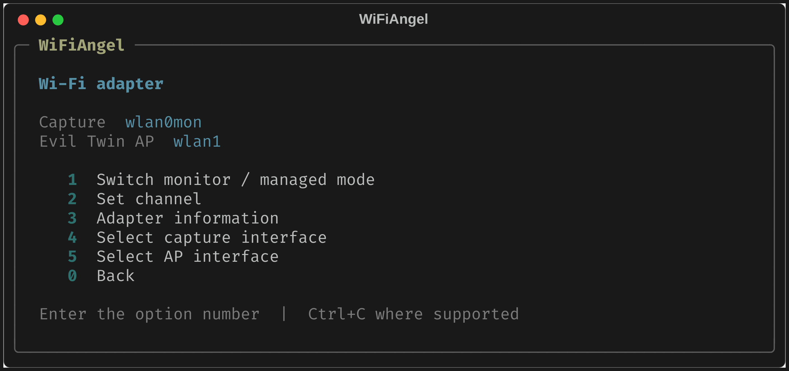

Technical intelligence submenu (quality, frames, artifacts, PMF/WPA3, profilers):

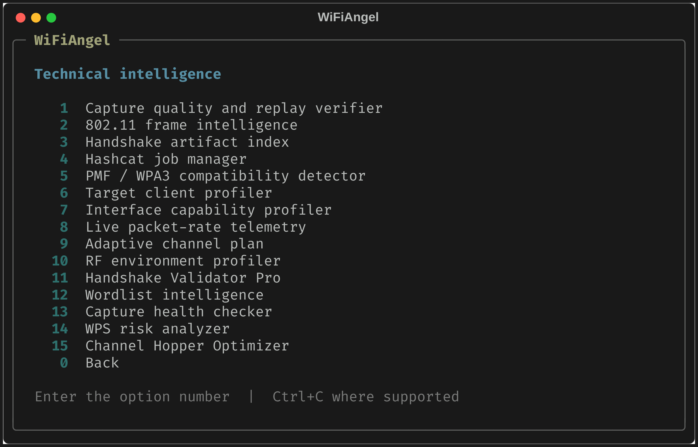

PMF / WPA3 compatibility table:

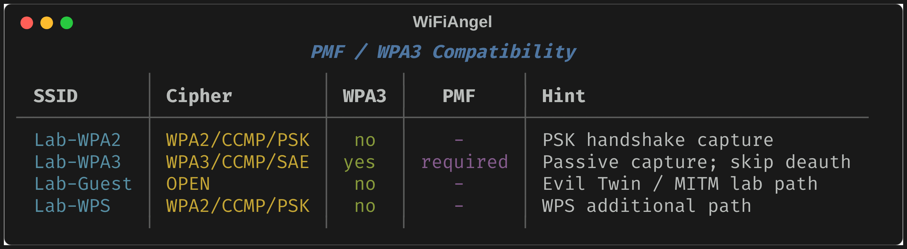

Network statistics and associated clients:

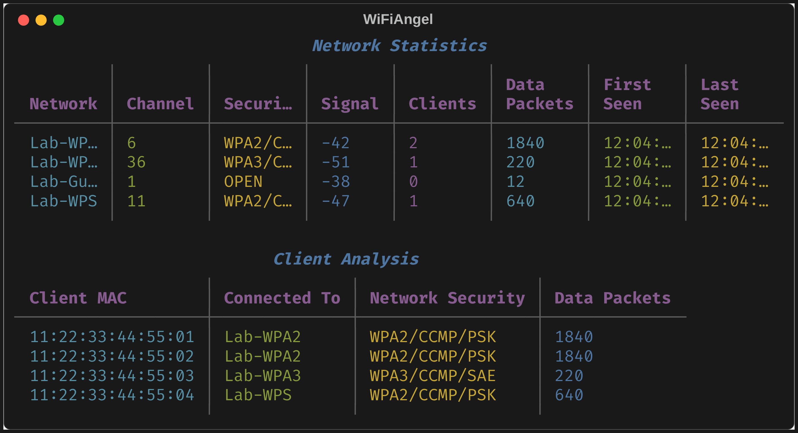

Probe SSIDs from airodump-ng **Probed ESSIDs** (Evil Twin default SSID source):

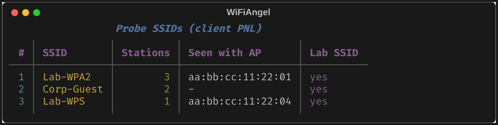

Session browser: handshake, auto-hack, MITM, and hashcat rows; re-validate, queue hashcat, or attach to the HTML report.

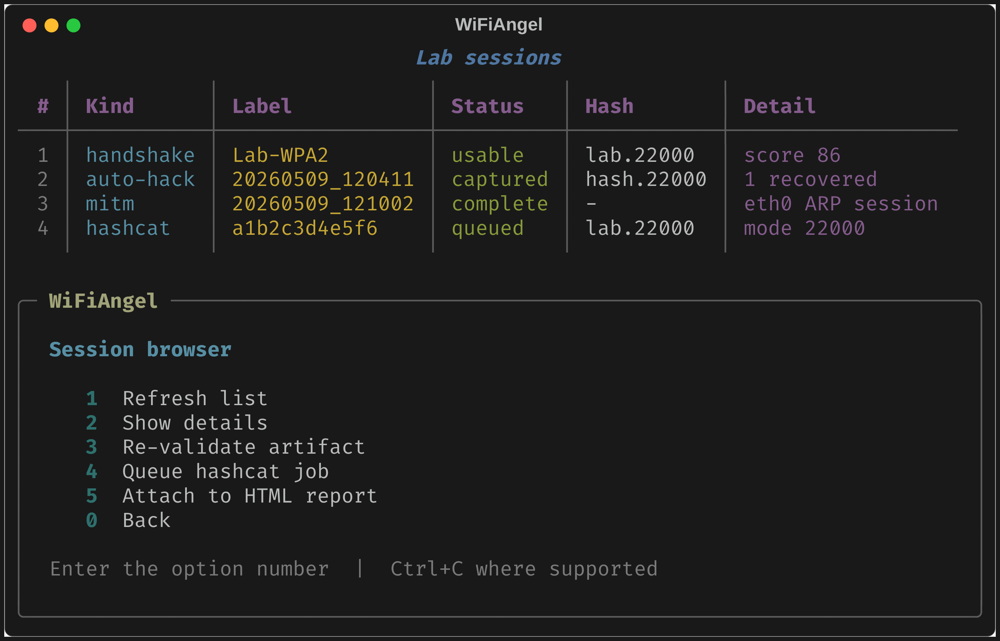

### Automated assessment

Option **6** ranks networks, runs sequential per-target capture, and prints results. Passphrases appear in the TUI; file logs redact them.

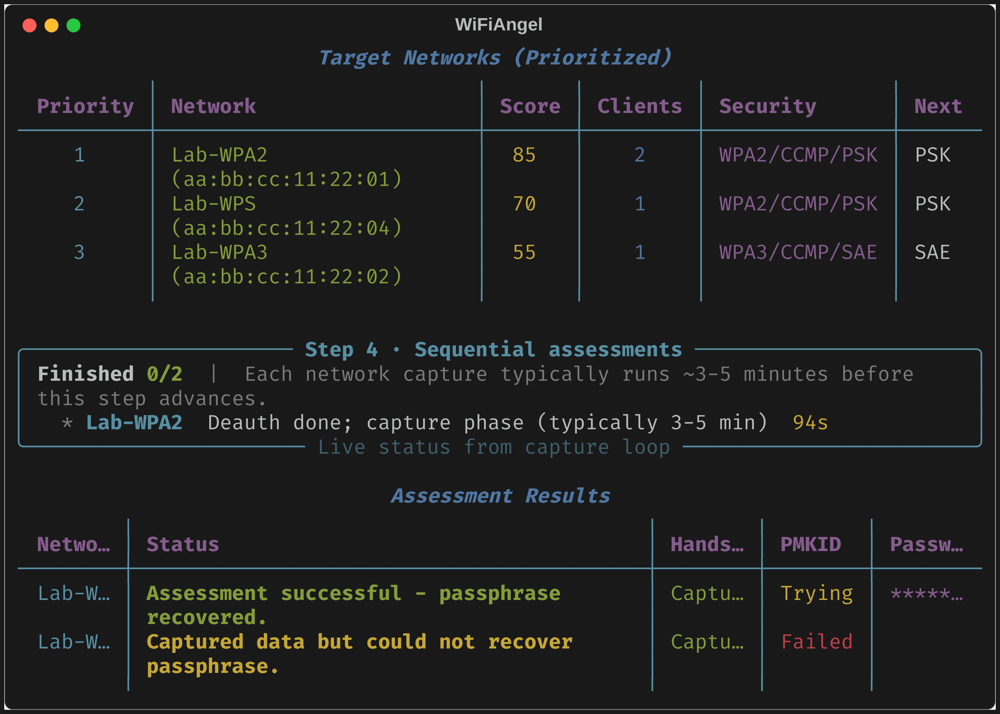

### Typical manual flow

1. Choose adapter at startup (if prompted).
2. **1** — monitor mode (or rely on **2** to auto-enable when scanning).
3. **2** — run scan; press **Enter** when done reviewing the live table.
4. **3** — pick target AP (playbook recommends the next module).
5. **4** — run a specific attack or lab module.

### Wordlists

Default paths are defined in **`config/defaults.py`**: `wordlists/1mil-AD-passwords.txt`, with a fallback hint to `/usr/share/wordlists/rockyou.txt`. Dictionary and automated assessment flows prompt or fall back if files are missing.

---

## Screenshots

Every TUI panel captured for this README (lab sample data, not a live RF session). Regenerate with `python3 scripts/capture_tui_screens.py`.

| Screen | File |
|--------|------|
| Welcome | `images/welcome.png` |
| Main menu | `images/main_menu.png` |
| Main menu + live scan | `images/main_menu_scan.png` |
| Attack techniques | `images/Attack_techniques.png` |
| Deauthentication | `images/deauthentication.png` |
| Handshake capture | `images/handshake_capture.png` |
| Hashcat job manager | `images/hashcat_job_manager.png` |
| Hashcat jobs | `images/hashcat_jobs.png` |
| Evil Twin lab | `images/evil_twin.png` |
| MITM dashboard | `images/mitm_dashboard.png` |
| Tools | `images/tools.png` |
| Wi-Fi adapter | `images/wifi_adapter.png` |
| Technical intelligence | `images/technical_intelligence.png` |
| PMF / WPA3 | `images/pmf_wpa3.png` |
| Network statistics | `images/network_statistics.png` |
| Probe SSIDs | `images/probe_ssids.png` |
| Session browser | `images/session_browser.png` |
| Select target | `images/select_target.png` |
| Automated assessment | `images/automated_assessment.png` |

These same files are shown in [Using the application](#using-the-application).

---

## Runtime files and reports

| Path | Purpose |
|------|---------|
| `logs/` | Per-run log trees (`main.log`, `attacks.log`, …) |
| `handshake/` | Handshake `.cap` / related capture material |
| `handshake/<ssid>_<bssid>_<timestamp>/capture_manifest.json` | Advanced handshake session manifest with quality history, deauth strategy, targeted clients, artifacts, and optional hashcat job metadata |
| `tmp/` | Temporary **`airodump-ng`** prefixes and scratch files |
| `auto_hack_sessions/` | Timestamped automated assessment outputs and reports |
| `logs/mitm/` | Bettercap-centric MITM session folders |
| `tmp/hashcat_jobs.json` | Hashcat job queue used by Attacks 9, Tools 17, and Tools 21 |

---

## Repository layout

| Path | Role |
|------|------|
| `wifiangel.py` | Entry point → `app.main:main` |
| `app/wifi_angel.py` | Thin orchestrator facade (menus, delegates) |
| `app/main.py` | Environment checks and app bootstrap |
| `app/controllers/` | Main, attack, and tools menu loops |
| `app/services/` | Scan, capture, lab AP, MITM, tools, lifecycle |
| `app/ui/` | Rich theme (`theme.py`) and shared widgets (`components.py`) |
| `app/logger.py` | File logging and report hook |
| `adapters/system_tools/` | `CommandRunner`, `WiFiAdapterManager`, speed/ping helpers |
| `attacks/` | External command builders, output parsers, and hashcat job store |
| `wifi/` | `airodump-ng` CSV parsing, frame helpers, capture quality, artifact indexing, telemetry, and profiling |
| `cleanup/` | Scoped iptables helpers (`WIFIANGEL_ET_*`, `WIFIANGEL_MITM_NAT`) |
| `config/` | Defaults, `PATH` checks, runtime dir creation |
| `reports/` | HTML / security report generation |
| `scripts/capture_tui_screens.py` | Regenerates README screenshots from Rich panels |
| `tests/` | `pytest` suite |
| `wordlists/` | Bundled or placeholder wordlists (large lists may be gitignored) |

---

## Development

```bash
python -m pytest
```

Refresh README screenshots (needs Chromium + ImageMagick):

```bash
python3 scripts/capture_tui_screens.py
```

---

## License and disclaimer

This project is licensed under the **GNU General Public License v3.0**. See the `LICENSE` file.

The authors and contributors are **not** responsible for misuse. You alone are responsible for complying with applicable laws and for obtaining **proper authorization** before testing any network.
